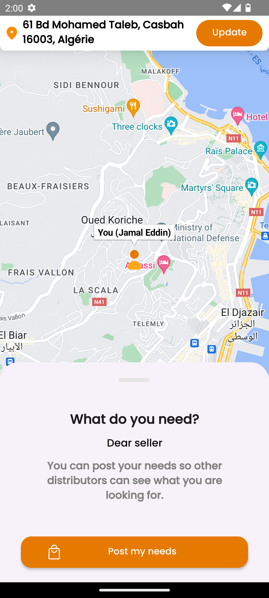

# VendVite Express Mobile App

##### We are updating our UI 💫

<table>
  <tr>
    <td></td>
    <td>VendVite Express is a revolutionary mobile application designed to connect individuals facing vehicle troubles with nearby car repair stations. With a focus on convenience, efficiency, and user experience, VendVite Express provides real-time assistance to those in need, making the process of getting your vehicle repaired as seamless as possible.</td>
  </tr>
</table>

## Screenshots

<table>
  <tr>
    <td align="center">
      
    </td>
    <td align="center">
      
    </td>
    <td align="center">
      
    </td>
    <td align="center">
      
    </td>
  </tr>
</table>

## Key Features

###### **Tested on API VERSION 33**

### _The app still under development.._

* **Real-time Repair Station Matching:** VendVite Express uses advanced location-based services to connect you with nearby repair stations. No more endless searching - find help at the touch of a button.
* **Secure Transactions:** Safety is our top priority. VendVite Express ensures secure transactions with verified repair stations, providing you with peace of mind.
* **User-friendly Interface:** With its intuitive design and easy-to-navigate interface, VendVite Express makes finding help a breeze.
* **Efficient Communication Process:** Communicate directly with repair stations through the app. Discuss issues, arrange services, and finalize transactions in a few simple steps.
* **Detailed Service Listings:** Repair stations can create comprehensive service listings with detailed descriptions and high-quality images. Make your services stand out and attract the right customers.

## Technologies

* **Kotlin:** Modern, concise, and safe programming language for robust Android development.
* **Firebase Auth:** Secure and easy-to-implement user authentication system.
* **Firebase Firestore:**  Scalable NoSQL cloud database for real-time data synchronization.
* **Google Maps API:** Integration for location management and route optimization.
* **View Binding:** Eliminates findViewById calls, making code cleaner.
* **RxJava:** Streamline asynchronous operations and event handling.
* **Coroutines:** Simplify asynchronous programming with easy-to-read code.
* **Navigation Component:** Structuring in-app navigation for intuitive user experiences.

## Getting Started

**Prerequisites**

* Android Studio (latest recommended)
* A Firebase Project with Firestore and Authentication enabled (Email & Password)
* A Google Maps API key (Enable the API from google cloud console)

**Installation**

1. Clone this repository: `git clone https://github.com/devunionorg/VendViteExpressAndroid`
2. Open the project in Android Studio.
3. Obtain your Google Maps API key and add it to your project's configuration inside `secrets.properties` file, don't forget to setup `local.defaults.properties` file following instructions from official doc's.
4. Set up your Firebase project and link it to the Android app.

## Project Structure

* `app/src/main/java/com/ensb/vendviteexpress`
  * `data`: Data models, repositories, and data sources.
  * `view`: Views (Activities/Fragments), ViewModels, Adapters.
  * `utils`: Helper classes and extension functions.
* `app/build.gradle`: Project dependencies and configurations.

#### This project is a part of Google Developer Student Clubs Solution Challenge !

### About US :
* ##### [GDSC ENSB](https://github.com/gdsc-ensb) - National school of biotechnology - Algeria
* ##### [DevUnionHQ](https://github.com/devunionorg) - Software development company - France
* ##### [ABDEL ILLAH B](https://github.com/abdelillahbel) : GDSC ENSB Core team member and IT manager at DevUnion & VendVite App owner & developer.